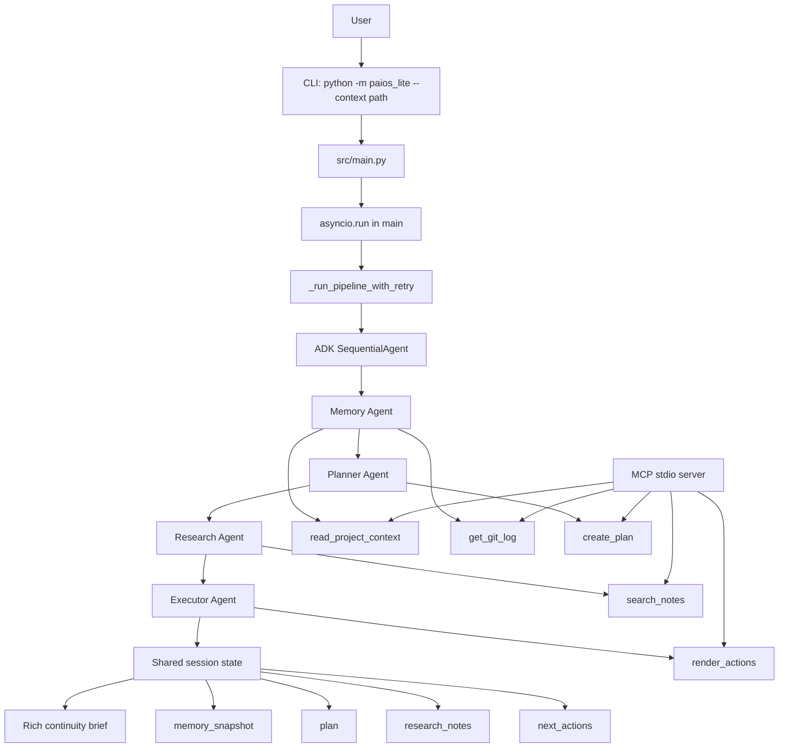
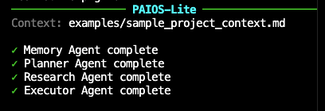
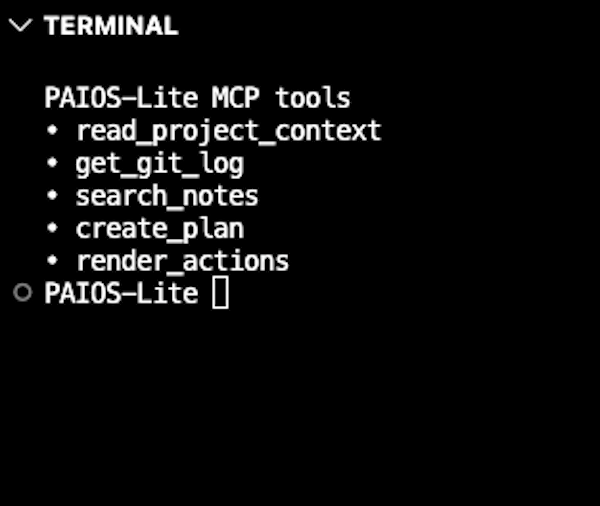
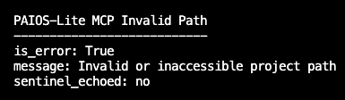
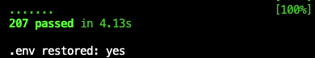
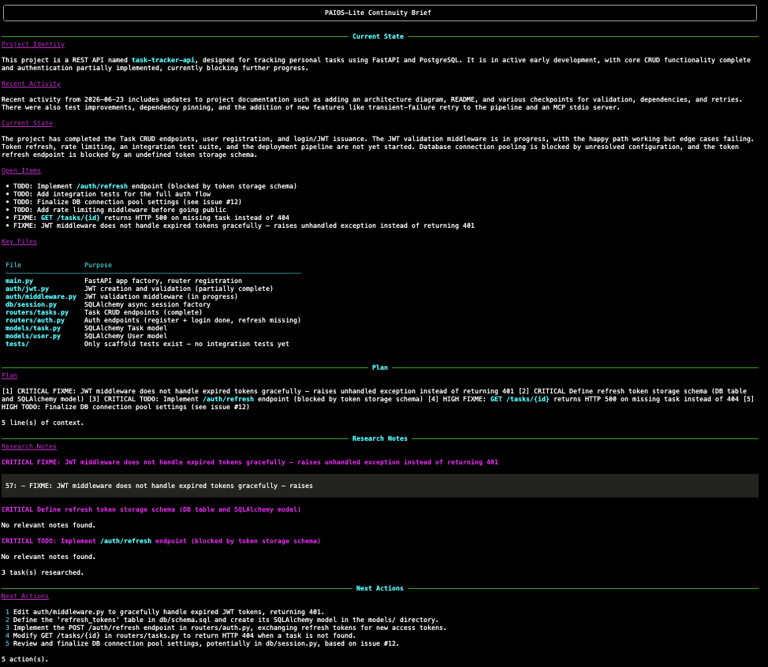

# PAIOS-Lite

PAIOS-Lite is a local project-continuity assistant that analyzes project context and produces an actionable continuity brief for the next development session.

## Capstone Track

**Concierge Agents** — PAIOS-Lite helps an individual developer regain context, understand current project state, and choose the next concrete actions without deploying a service or storing project data.

## Problem

Software projects often lose momentum between coding sessions. A developer may return to a repository with stale memory of recent commits, TODO markers, design notes, and next steps. Rebuilding that context manually is slow and error-prone.

## Solution

PAIOS-Lite runs a four-agent Google ADK pipeline from the terminal:

```text
Memory Agent → Planner Agent → Research Agent → Executor Agent
```

The agents read local project context, summarize current state, plan the next work, search local notes for supporting context, and render copy-pasteable next actions. The final output is a Rich terminal continuity brief with four ordered sections.

## Key Capabilities

- Local CLI workflow: `python -m paios_lite --context <path>`
- Four Google ADK `LlmAgent` agents orchestrated by one `SequentialAgent`
- Five pure-Python local tools shared by the agents and MCP server
- FastMCP stdio server for external MCP clients
- Environment-based model and API-key configuration
- Sanitized terminal errors for provider failures
- Sanitized MCP path errors for external tool callers
- Exponential retry for transient provider failures
- Network-free, key-free automated test suite

## Architecture Overview




The MCP server is an additional access path to the existing local tools. It does not replace the CLI pipeline.

## Agent Roles

| Agent | Role | Tool access | Output key |
|---|---|---|---|
| Memory Agent | Reads project files and git history, then summarizes project state. | `read_project_context`, `get_git_log` | `memory_snapshot` |
| Planner Agent | Converts the memory snapshot into an ordered task plan. | `create_plan` | `plan` |
| Research Agent | Searches local Markdown notes for context relevant to high-priority tasks. | `search_notes` | `research_notes` |
| Executor Agent | Turns the plan and research notes into concrete next actions. | `render_actions` | `next_actions` |

## State Flow

The initial session state contains `project_path`. Each agent writes one downstream state key:

```text
project_path
  -> memory_snapshot
  -> plan
  -> research_notes
  -> next_actions
```

The CLI renders those four final state values as:

1. Current State
2. Plan
3. Research Notes
4. Next Actions

## Quick Start

Requirements: **Python 3.11+**

```bash
git clone https://github.com/Bvega/paios-lite-capstone.git
cd paios-lite-capstone

python3 -m venv .venv
source .venv/bin/activate

python -m pip install -r requirements.txt
cp .env.example .env
```

Then edit `.env` and add the provider API key that matches `LLM_MODEL`. Do not commit `.env`; it is ignored by Git.

## Environment Configuration

`LLM_MODEL` selects the configured model. The demonstrated runtime uses Gemini, with `GOOGLE_API_KEY` loaded from the environment. The template also documents Anthropic and local Ollama-style configuration options, but not every provider has been live-tested in this project.

```text
LLM_MODEL=gemini/gemini-2.0-flash-exp
GOOGLE_API_KEY=
```

Provider credentials are read from environment variables only. No API key should appear in source code, documentation commits, or terminal recordings. Antigravity is not required to run PAIOS-Lite.

## CLI Usage

Show command help:

```bash
python -m paios_lite --help
```

Run the demo fixture:

```bash
python -m paios_lite --context examples/sample_project_context.md
```

### Successful agent run



You can also pass a local project directory or supported context file:

```bash
python -m paios_lite --context /path/to/project
```

## MCP Server Usage

Start the FastMCP stdio server:

```bash
python -m paios_lite.tools.mcp_server
```

The MCP server exposes the same five local tools used by the agents:

- `read_project_context`
- `get_git_log`
- `search_notes`
- `create_plan`
- `render_actions`

### MCP tool discovery



### Sanitized MCP error handling



The invalid-path example shows that the tool call is marked as an error, the public message is sanitized, and private sentinel path details are not echoed back to the caller.

Because MCP uses stdio transport, it opens no web port and requires no deployment.

## Security and Reliability

- Credentials are loaded from environment variables.
- `.env` is ignored by Git; `.env.example` contains placeholders only.
- Tool path handling rejects null bytes and resolves paths before access.
- Git history is read through subprocess argument-list execution without `shell=True`.
- MCP wrappers replace invalid path details with a safe error message.
- Provider terminal errors are summarized by HTTP code or exception class instead of raw provider text.
- Retry classification is explicit: only transient provider and network failures are retried.

## Retry and Backoff

The pipeline entry point retries transient failures with:

- 3 total attempts
- approximately 2-second and 4-second exponential delays
- 0.0 to 1.0 seconds of uniform jitter
- retryable HTTP codes: 408, 429, 500, 502, 503, 504
- retryable network exceptions: `httpx.TimeoutException`, `httpx.ConnectError`

Non-retriable errors fail immediately.

## Testing and Validation

Run the test suite:

```bash
python -m pytest tests/ -q
```

Run compile and dependency checks:

```bash
python -m compileall -q paios_lite src tests
python -m pip check
```

Phase 3 validation recorded:

- Python 3.14 development validation
- clean Python 3.11 validation
- `207 passed`
- official MCP client validation passed
- controlled live Gemini CLI validation passed

### Test-suite evidence



The captured validation output records the network-free suite with 207 passing tests.

## Demo Fixture

The repository includes:

```text
examples/sample_project_context.md
```

This fixture provides a stable context file for demos, screenshots, and video recording.

### Generated continuity brief



The generated brief shows the demo fixture rendered as the same four-section continuity output used by the CLI workflow.

## Current Project Status

Phase 3 is complete. Phase 4 is preparing the final README, architecture documentation, demo materials, Kaggle write-up, and submission checklist.

## Limitations

- PAIOS-Lite is a local CLI, not a web app.
- It does not include a REST API, database, production hosting, or persistent memory service.
- Live LLM execution requires a configured provider key unless using a local model path that does not require one.
- Automated tests mock infrastructure and do not make live provider calls.
- The MCP server exposes local tools; it does not run the four-agent CLI pipeline.

## Future Improvements

- Add polished demo screenshots and a short video walkthrough.
- Add optional output-to-file support.
- Add richer note-search ranking for large repositories.
- Add a final public submission checklist.
- Explore additional providers after explicit live validation.

## Repository Structure

```text
paios_lite/              Package entry points
src/main.py              CLI, retry boundary, SequentialAgent orchestration
src/config.py            Environment-based model and key validation
src/agents/              Four ADK LlmAgent definitions
src/tools/               Local tools and FastMCP stdio server
tests/                   Network-free pytest suite
examples/                Demo context fixture
docs/                    Architecture, validation, and submission docs
demo/                    Demo script notes
requirements.txt         Exact direct dependency pins
```

## Submission Links

- Kaggle write-up: Coming before submission
- Demo video: Coming before submission
- Public repository: https://github.com/Bvega/paios-lite-capstone
