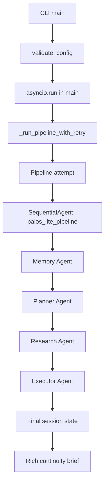
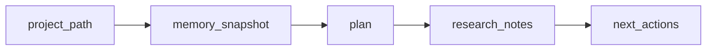
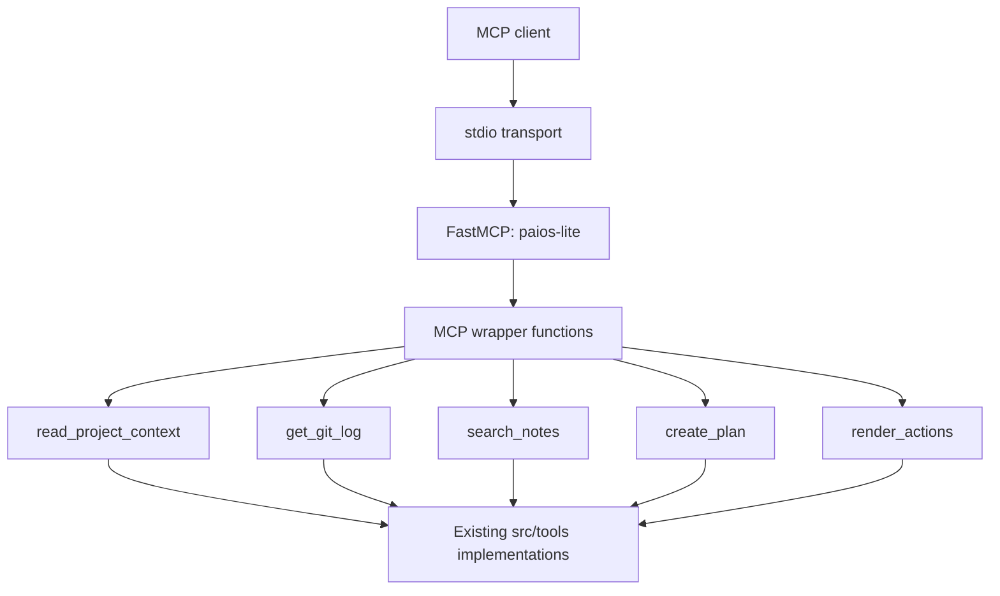
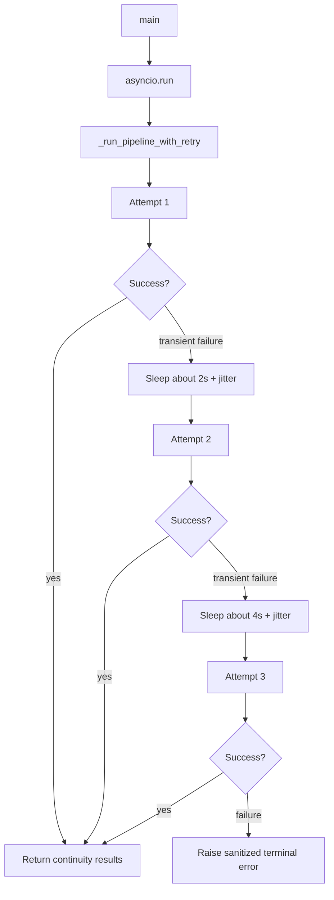

# Architecture — PAIOS-Lite

> Updated: 2026-06-23
> Scope: Completed Phase 3 system
> Authority: `docs/ARCHITECTURE_LOCK.md`

---

## 1. System Purpose

PAIOS-Lite is a local CLI project-continuity assistant. It accepts a local
project path, runs a four-agent Google ADK pipeline, and prints a structured
continuity brief for the next development session.

The system is intentionally local-first:
- No web UI
- No REST API
- No database
- No deployment requirement
- No persistent memory service

---

## 2. Package Layout

```text
paios_lite/
  __main__.py              Enables python -m paios_lite
  tools/mcp_server.py      Delegates python -m paios_lite.tools.mcp_server

src/
  main.py                  CLI, retry wrapper, ADK orchestration
  config.py                Environment and provider-key validation
  agents/
    memory_agent.py        Memory Agent factory
    planner_agent.py       Planner Agent factory
    research_agent.py      Research Agent factory
    executor_agent.py      Executor Agent factory
  tools/
    context_reader.py      read_project_context, get_git_log
    note_searcher.py       search_notes
    plan_tools.py          create_plan, render_actions
    mcp_server.py          FastMCP stdio wrapper around local tools

tests/                     Network-free automated tests
examples/                  Demo fixture
docs/                      Architecture and validation documentation
```

---

## 3. CLI Entry Path

The public CLI command is:

```bash
python -m paios_lite --context <path>
```

`paios_lite/__main__.py` delegates to `src.main.main()`. `src/main.py` owns
argument parsing, path existence checks, configuration validation, one
`asyncio.run()` call, retry handling, ADK orchestration, and Rich terminal
rendering.

---

## 4. Four-Agent Orchestration

The pipeline order is fixed:

```text
Memory Agent → Planner Agent → Research Agent → Executor Agent
```

Each attempt creates:
- one ADK `SequentialAgent`
- one `Runner`
- one `InMemorySessionService`
- one session

`main()` owns one `asyncio.run()` call. Retry attempts execute inside that event
loop through `_run_pipeline_with_retry()`.



---

## 5. Agent Responsibilities

| Agent | File | Responsibility | Tools | Output key |
|---|---|---|---|---|
| Memory Agent | `src/agents/memory_agent.py` | Reads project context and git history, then produces a concise memory snapshot. | `read_project_context`, `get_git_log` | `memory_snapshot` |
| Planner Agent | `src/agents/planner_agent.py` | Converts the memory snapshot into an ordered task plan. | `create_plan` | `plan` |
| Research Agent | `src/agents/research_agent.py` | Searches Markdown notes for context relevant to high-priority tasks. | `search_notes` | `research_notes` |
| Executor Agent | `src/agents/executor_agent.py` | Converts plan and research context into concrete next actions. | `render_actions` | `next_actions` |

Each agent exposes a `build_agent()` factory that returns a Google ADK
`LlmAgent`. Agent files do not create event loops, runners, or session services.

---

## 6. Shared Session-State Contract

Initial state:

```text
project_path: <CLI context path>
```

Agent output keys:

```text
memory_snapshot
plan
research_notes
next_actions
```

State flow:



The CLI reads the final session state after the ADK event stream is exhausted
and renders the four output keys in order.

---

## 7. Local Tool Layer

All local tools are pure Python functions. They do not call an LLM and do not
make network calls.

| Tool | Source file | Signature |
|---|---|---|
| `read_project_context` | `src/tools/context_reader.py` | `(path: str) -> str` |
| `get_git_log` | `src/tools/context_reader.py` | `(path: str, n: int = 10) -> str` |
| `search_notes` | `src/tools/note_searcher.py` | `(query: str, path: str) -> str` |
| `create_plan` | `src/tools/plan_tools.py` | `(context: str) -> str` |
| `render_actions` | `src/tools/plan_tools.py` | `(plan: str) -> str` |

The agents register these same Python callables as tools.

---

## 8. MCP Stdio Layer

The MCP server uses FastMCP with stdio transport:

```bash
python -m paios_lite.tools.mcp_server
```

`paios_lite.tools.mcp_server` delegates to `src.tools.mcp_server`. The MCP
module registers wrappers around the existing local tool implementations; tool
logic is not duplicated.



MCP is an external access path to the five local tools. It does not run or
replace the four-agent CLI pipeline.

---

## 9. Retry and Failure Handling

Retry lives at the pipeline entry point in `src/main.py`. The retry wrapper
surrounds complete pipeline attempts, so each attempt gets fresh ADK runtime
objects.



Retry policy:
- maximum total attempts: 3
- exponential delays: approximately 2 seconds, then 4 seconds
- jitter: 0.0 to 1.0 seconds
- retryable HTTP codes: 408, 429, 500, 502, 503, 504
- retryable network exceptions: `httpx.TimeoutException`, `httpx.ConnectError`
- non-retriable errors propagate immediately

Provider terminal errors are summarized by HTTP code or exception class.

---

## 10. Security Boundaries

Security controls are intentionally simple and visible:

- API keys are read from environment variables.
- `.env` is ignored by Git.
- `.env.example` contains placeholders only.
- Path tools reject null bytes and resolve paths before access.
- Missing paths are rejected before tool access.
- Markdown note search remains under the supplied root.
- Git history uses subprocess argument-list execution without `shell=True`.
- MCP path errors are sanitized as `Invalid or inaccessible project path`.
- Raw provider errors are not printed to the terminal.
- Tool functions do not perform LLM calls or network I/O.

---

## 11. Dependency Strategy

`requirements.txt` is the authoritative dependency file. Direct dependencies
are pinned exactly:

```text
google-adk==2.3.0
google-genai==2.9.0
python-dotenv==1.2.2
rich==15.0.0
mcp==1.28.0
httpx==0.28.1
pytest==9.1.1
```

Transitive dependencies remain resolver-managed. No platform-specific lock file
is committed.

---

## 12. Runtime and Test Flow

Normal runtime:

```bash
python -m paios_lite --context examples/sample_project_context.md
```

MCP runtime:

```bash
python -m paios_lite.tools.mcp_server
```

Validation commands:

```bash
python -m pytest tests/ -q
python -m compileall -q paios_lite src tests
python -m pip check
```

Phase 3 validation recorded `207 passed` in both the Python 3.14 development
environment and a clean Python 3.11 environment.

---

## 13. Architecture Invariants

These invariants should remain true unless the architecture lock is explicitly
revised:

- CLI entry point remains `python -m paios_lite --context <path>`.
- Pipeline order remains Memory -> Planner -> Research -> Executor.
- `src/main.py` owns the event loop, `SequentialAgent`, `Runner`, and session service.
- Agent files expose `build_agent()` and do not create runners or event loops.
- The four output keys remain `memory_snapshot`, `plan`, `research_notes`, and `next_actions`.
- Local tools remain pure Python and local-only.
- MCP uses stdio transport and reuses existing local tool implementations.
- Automated tests remain network-free and key-free.

---

## 14. Known Limitations

- There is no web UI, REST API, cloud deployment, or database.
- No persistent memory is stored between CLI runs.
- The MCP server exposes the five local tools, not the full agent pipeline.
- Live LLM runs require a configured provider key unless using a local no-key model.
- The demonstrated live runtime used Gemini; other provider options are documented but not all have been live-tested.
- Upstream ADK/GenAI/OpenTelemetry deprecation warnings remain non-blocking.

---

## Revision History

| Date | Change |
|---|---|
| 2026-06-22 | Initial content documenting Phase 2 implementation |
| 2026-06-23 | Updated for completed Phase 3: MCP stdio, retry, security hardening, pinned dependencies |
